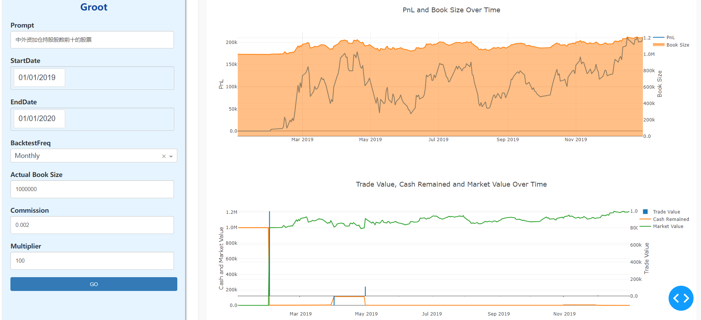
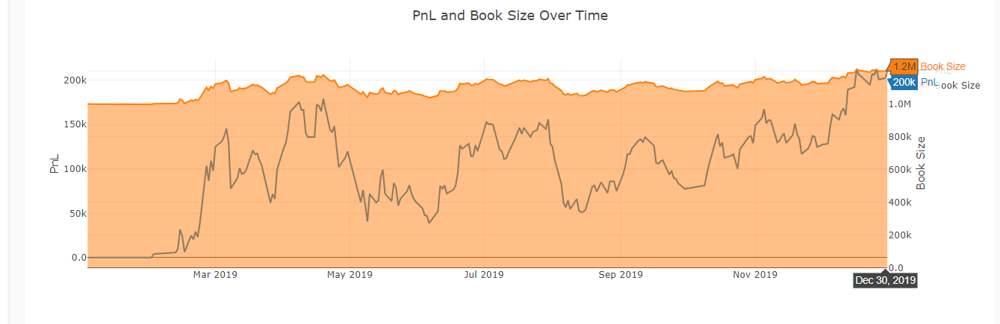
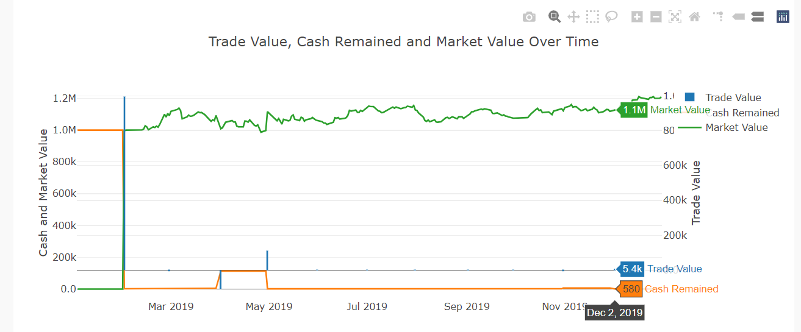
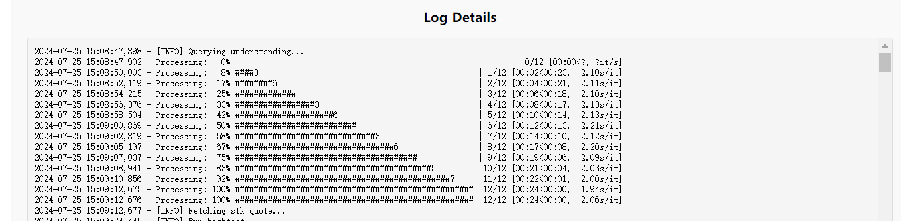
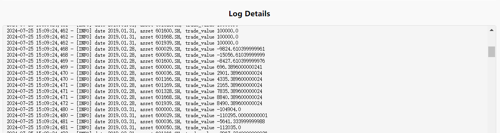

# groot: Make your flash of thought tradable
一个通过大模型语义理选股股并完成A股策略回测与策略报告输出的量化玩具，目的是**快速验证投资小念头**。

`groot`是一个将机构主观思维进行量化验证的尝试，其目的在于把一些投资思路转化为可交易的信号。

---
 A quantitative tool that selects stocks through a large model semantic filtering and completes *A-share* strategy backtesting and strategy report output, aiming to **quickly verify investment ideas.**

`groot` is an attempt to quantitatively verify institutional subjective thinking, with the goal of transforming some investment ideas into **tradable** signals.

## 立刻开始
在terminal中输入
```bash
python main.py
```

### 向groot提出一个投资思路
#### 可以尝试各种prompt
- 中外资加仓持股股数前十的股票
- 连续10日资金流入前十的股票
- 周平均换手率大于10%的5G概念股中市值前10的股票

### 另外一些可定义的参数
| 参数             | 参数说明                                                   |
| ---------------- | ---------------------------------------------------------- |
| StartDate        | 回测开始时间                                               |
| EndDate          | 回测结束时间                                               |
| BacktestFreq     | 再平衡周期                                                 |
| Actual Book Size | 账户实际初始资金                                           |
| Commision        | 交易佣金，默认千二                                         |
| Multiper         | 交易乘数，股票按手买卖，默认100<br>回测指数的话可以设置为1 |


## 得到直观结果
### 结果图表


### 在交易记录台查看日志



#### 感谢
- [x] [挖地兔tushare](https://www.tushare.pro/document/2):提供股票日行情数据api接口
- [x] [同花顺问财](https://www.iwencai.com/unifiedwap/home/index)：提供标准的数据字典和免费的智能查询；也要感谢[zsrl提供的开源工具](https://github.com/zsrl/pywencai#loop)


#### 最后
1. 需要**有明确的语义定位到有限个股票**，范围太大的模糊语义容易卡死；
2. 如果请求股票代码报错，大概率是网络问题，请刷新浏览器重新点击`Go`；
3. 大模型选股的语义理解步骤需要在时间轴反复提交prompt请求，性能上暂时无法提速，效率考虑不开放日频等回测频率。
4. 需要安装node.js v16+
